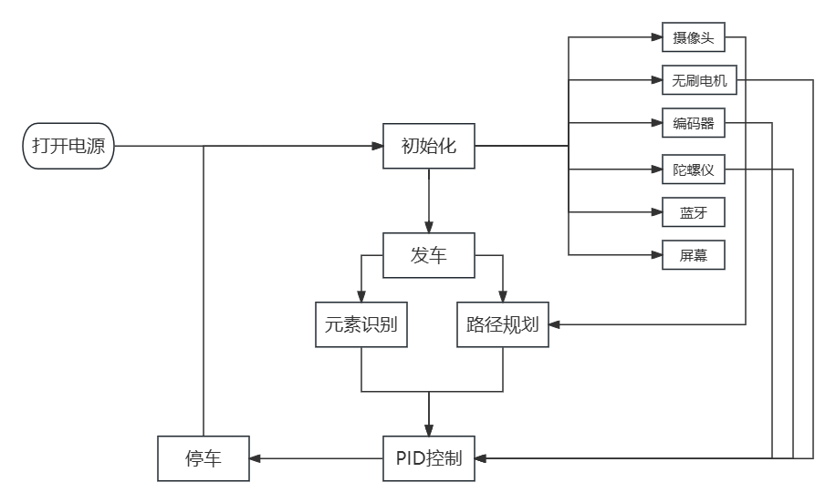
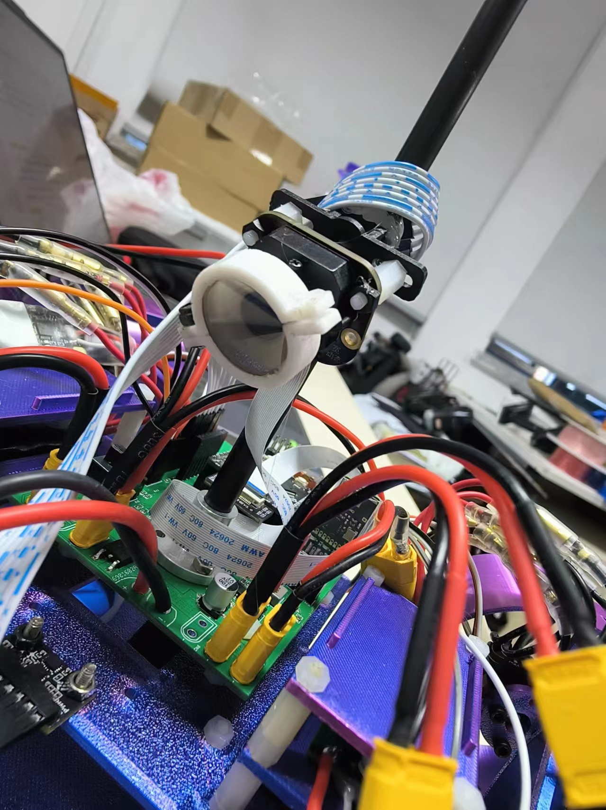
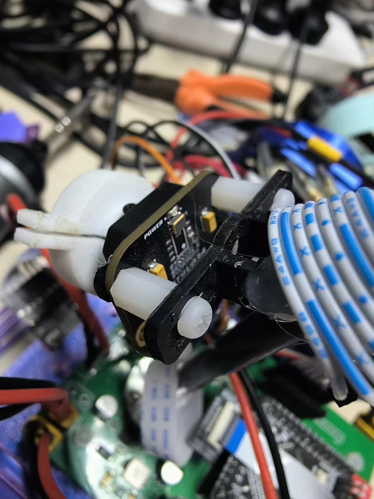
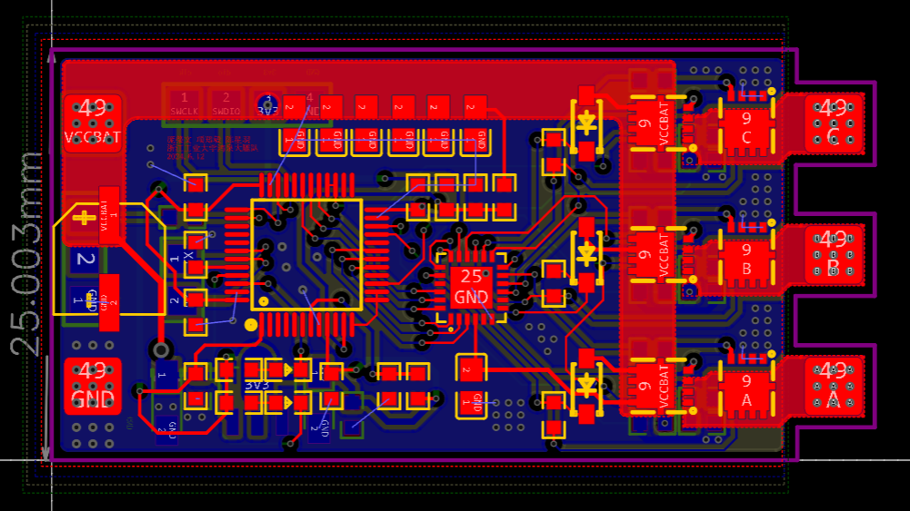
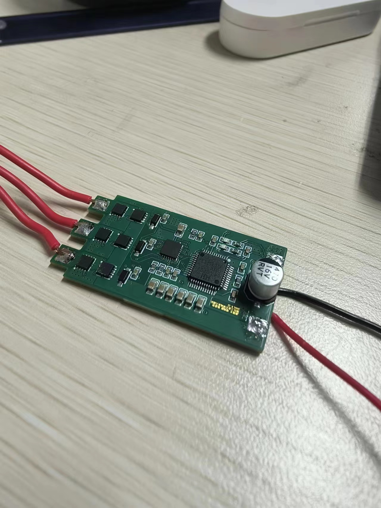
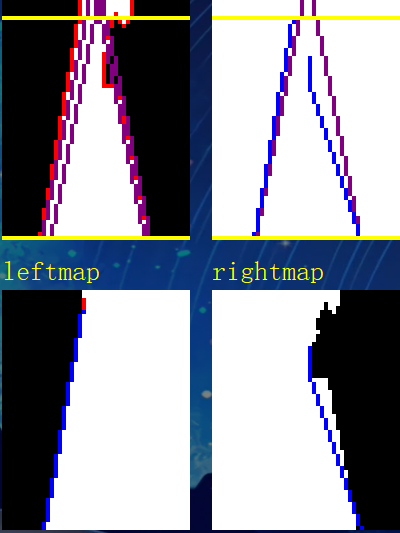
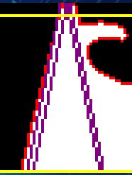
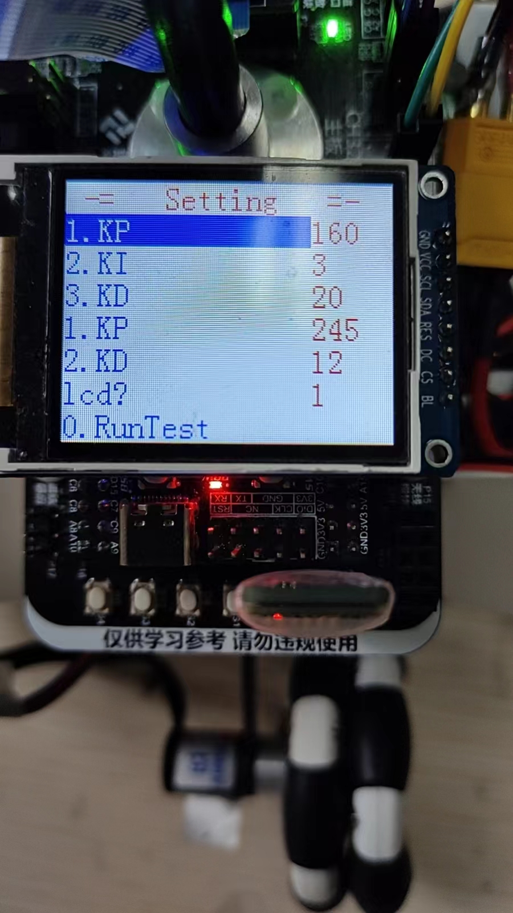
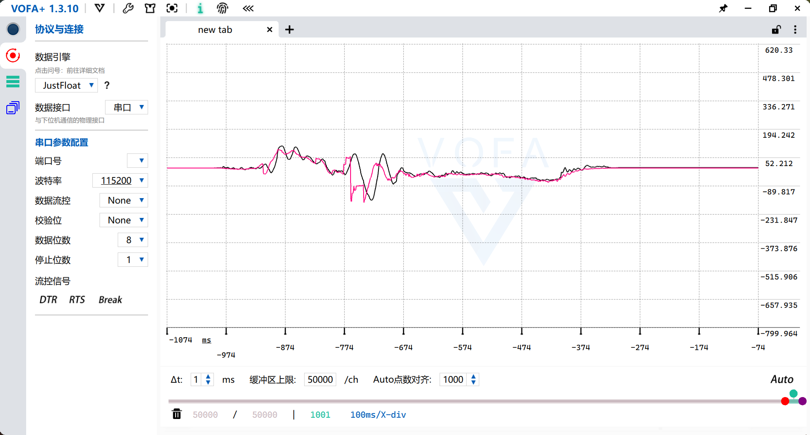
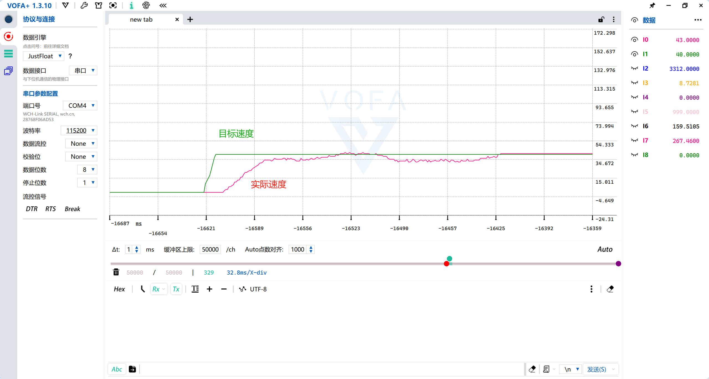

# 气垫船实现与调试记录

本页整理自训练期间留下的项目材料，用于补充说明本仓库中 SolidWorks 车模的实际装配和调试过程。原始报告含人员、院校及其他不适合公开的信息，因此仓库只保留与车模结构和开发过程直接相关的图片与概述。

## 系统方案

车模以 CH32V307 为主控，开发流程覆盖硬件初始化、摄像头图像处理、赛道状态判断、姿态与速度反馈以及电机控制。机械模型为摄像头、控制板、动力单元、编码测速机构和电池提供安装空间。

## 3D 打印结构与实车安装

| 摄像头支架与车体安装 | 支架局部细节 |
| --- | --- |
|  |  |

图中可见摄像头及其定制支架在车体前部的安装状态。支架用于固定相机视角，并与分层车架和电子器件安装空间配合。图片展示的是开发阶段实物，最终装配细节可能与仓库内 CAD 文件存在小幅差异。

## 无刷驱动板

| PCB 布局记录 | 实物焊接与调试 |
| --- | --- |
|  |  |

无刷驱动板用于动力系统调试。这里仅展示布局与实物照片，仓库没有提供原理图、PCB 工程文件、固件或可直接生产的制板资料。

## 视觉处理与板载调参

| 赛道边界提取 | 障碍识别结果 | 板载调参界面 |
| --- | --- | --- |
|  |  |  |

摄像头图像经过灰度化、二值化和边界提取，用于判断赛道状态；板载显示界面用于观察运行状态并调整参数。截图仅反映当时的软件调试过程，本仓库不包含对应源代码。

## 控制调试曲线

### 姿态反馈

曲线用于对比姿态相关的计算值与反馈趋势，帮助检查传感器数据处理和控制响应。

### 速度响应

目标速度与实际速度曲线用于观察加速过程和稳定状态，并辅助调整速度控制参数。同样地，该图属于开发记录，而不是标准化测试报告。

## 资料边界

- 本页图片来自项目开发阶段的训练材料，经筛选后用于公开展示。
- 机械设计源文件仍以 [`cad/solidworks/`](../cad/solidworks/) 目录为准。
